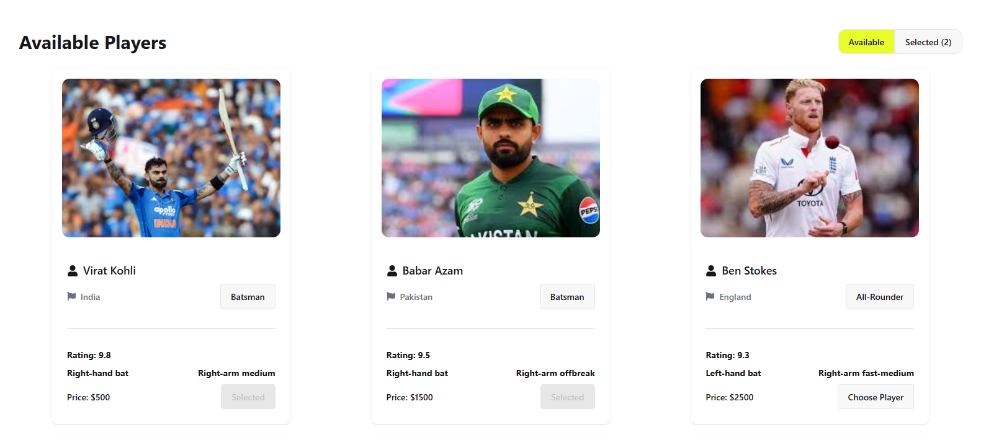
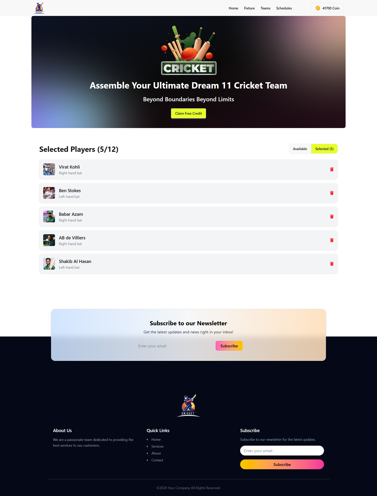
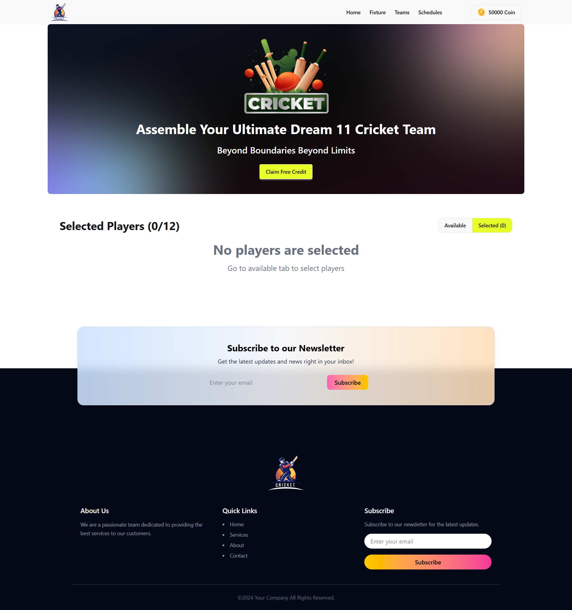

<div align="center">

# 🏏 BPL Dream 11

### *Build your ultimate fantasy cricket squad.*

An interactive fantasy cricket team builder where users create a strategic 11-player squad within a limited coin budget, balancing skill, strategy, and resource management.

<br/>

[](https://reactjs.org/)
[](https://tailwindcss.com/)
[](https://daisyui.com/)
[](https://developer.mozilla.org/en-US/docs/Web/JavaScript)
[](https://fkhadra.github.io/react-toastify/introduction)

</div>

---

## 🚀 Overview

**BPL Dream 11** is a fantasy cricket team builder that focuses on strategic decision-making through a **coin-based selection system**. Users must carefully manage their virtual budget while selecting players, making the experience both interactive and competitive.

This project highlights practical React concepts such as **state management, conditional rendering, and dynamic UI updates**.

---

## 🌐 Live Demo

👉 **[View Live Project](https://bpl-dream-11-project-ph.netlify.app/)**

---

## 📸 Product Showcase

### 🏠 Hero & Player Marketplace


A modern and engaging hero section with a coin reward system and a responsive player marketplace designed for smooth browsing.

---

### 🃏 Player Cards



Responsive player cards displaying role, price, and key stats with a clean and structured UI layout. Each card includes an interactive “Choose Player” button that gets disabled and changes to “Selected” upon selection, ensuring clear and intuitive user feedback.

---

## 🛒 Team Management System

<details>
<summary><strong>✅ Selected Squad View</strong></summary>
<br/>



> Users can manage their fantasy squad in real time, with live updates for selected players (e.g., 3/11 squad tracking).
</details>

---

<details>
<summary><strong>⚠️ Empty States & Notifications</strong></summary>
<br/>



> Smart empty states combined with React Toastify alerts for validations like insufficient coins, duplicate selection, and squad limits.
</details>

---

## ✨ Key Features

- 🔄 Dynamic tab-based system (Available / Selected players)
- 💰 Coin-based smart selection logic
- 📦 Real-time player addition & removal
- 📊 Live squad count tracking (1–11 players)
- ⚠️ Smart validation system (coins, duplicates, limits)
- 🔔 Toast notifications for instant feedback
- 📱 Fully responsive UI across all devices

---

## 🛠 Tech Stack

| Technology | Purpose |
|------------|---------|
| React.js | UI Development |
| State Management | Coin balance & squad control |
| Tailwind CSS | Styling & responsiveness |
| DaisyUI | UI components |
| React Toastify | Notifications |
| React Icons | Icon system |

---

## 💡 What I Learned

- Managing shared state across components using React principles  
- Implementing real-world selection & validation logic  
- Handling conditional rendering for dynamic UI updates  
- Building responsive layouts with Tailwind CSS  
- Improving UX with instant feedback systems  

---

## 🏆 Project Highlight

The most exciting part of this project was building a **real-time coin-based selection system**, where every action immediately affects balance and squad status — making the experience feel like a real fantasy sports platform.

---

## 🚀 Getting Started

### Clone Repository

```bash
git clone https://github.com/abutalha08/bpl-dream-11.git
cd bpl-dream-11
npm install
npm run dev
```

---

## 📱 Responsive Design

BPL Dream 11 is fully responsive and optimized for mobile, tablet, and desktop devices, ensuring a smooth fantasy gaming experience across all screen sizes.

---

## 💙 Author

<div align="center">

Made with 💙 by [Abu Talha Taufique](https://github.com/abutalha08)

*BPL Dream 11 — where strategy meets fantasy cricket.*

© 2026 BPL Dream 11. All rights reserved.

</div>